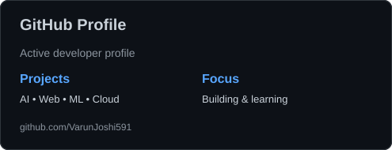
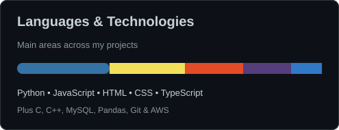
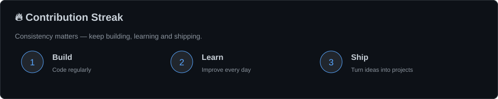
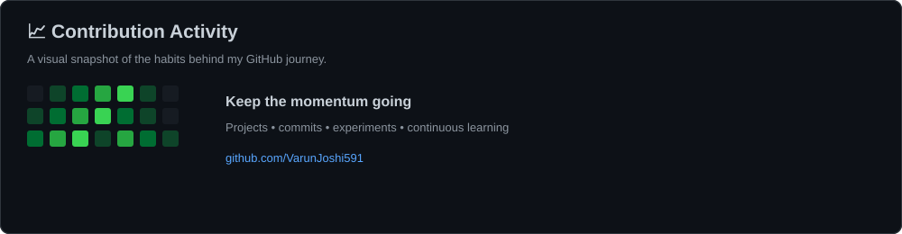

<div align="center">

# Hi 👋, I'm Varun Joshi

### MCS Student • Computer Science Graduate • Aspiring Software Developer

<p>
  <a href="https://portfolio-website-iota-fawn-26.vercel.app/">Portfolio</a> •
  <a href="https://linkedin.com/in/varun-joshi-287990306">LinkedIn</a> •
  <a href="mailto:joshivarun089@gmail.com">Email</a>
</p>


</div>

---

## 👨‍💻 About Me

- 🎓 Currently pursuing a **Master of Computer Science (MCS)**.
- 💻 Computer Science graduate passionate about **software development and problem solving**.
- 🤖 Currently working on **Levina AI**.
- 🌱 Currently learning **HTML, CSS, JavaScript & Frontend Development**.
- ☁️ Interested in **Cloud Computing, AI, Web Development & Software Engineering**.
- 🔨 I enjoy turning ideas into **working, useful projects**.
- 📚 Continuously improving my development skills through hands-on projects.

---

## 🎯 Current Focus

```text
Frontend Development  →  HTML • CSS • JavaScript
AI & ML               →  Practical AI/ML Projects
Cloud                 →  AWS & Cloud Technologies
Development Workflow  →  Git • GitHub • Clean Code
```

---

## ⭐ Featured Projects

### 🤖 SnapNote-AI
AI-powered SaaS that converts screenshots into smart, searchable notes using OCR and Large Language Models.

🔗 [View Repository](https://github.com/VarunJoshi591/SnapNote-AI)

### ☕ COFFEE-3D-WEBSITE
Premium coffee brand landing page featuring 3D product visualization, frame-by-frame animations, responsive design and modern frontend development.

🔗 [View Repository](https://github.com/VarunJoshi591/COFFEE-3D-WEBSITE)

### 🖐️ HandSense-AI
Real-time browser-based hand tracking with immersive 3D holographic visualization using MediaPipe and Three.js.

🔗 [View Repository](https://github.com/VarunJoshi591/HandSense-AI)

### 🧠 Heart-Disease-Prediction-ML
Machine learning project for heart disease prediction using Logistic Regression, Decision Tree and Random Forest algorithms.

🔗 [View Repository](https://github.com/VarunJoshi591/Heart-Disease-Prediction-ML)

---

## 🛠️ Languages & Tools

<p align="left">
  <a href="https://www.cprogramming.com/"></a>
  <a href="https://isocpp.org/"></a>
  <a href="https://www.python.org/"></a>
  <a href="https://developer.mozilla.org/en-US/docs/Web/HTML"></a>
  <a href="https://developer.mozilla.org/en-US/docs/Web/CSS"></a>
  <a href="https://developer.mozilla.org/en-US/docs/Web/JavaScript"></a>
  <a href="https://git-scm.com/"></a>
  <a href="https://github.com/"></a>
  <a href="https://www.mysql.com/"></a>
  <a href="https://pandas.pydata.org/"></a>
  <a href="https://aws.amazon.com/"></a>
</p>

---

## 📊 GitHub Analytics

<div align="center">
  
  
</div>

---

## 🔥 Contribution Streak

<div align="center">
  
</div>

---

## 📈 Contribution Activity

<div align="center">
  
</div>

---

## 🌐 Find Me Online

<div align="center">

<a href="https://linkedin.com/in/varun-joshi-287990306">
  
</a>
<a href="https://portfolio-website-iota-fawn-26.vercel.app/">
  
</a>
<a href="mailto:joshivarun089@gmail.com">
  
</a>
<a href="https://github.com/VarunJoshi591?tab=repositories">
  
</a>

</div>

---

<div align="center">

### 💡 Building, Learning & Improving — One Project at a Time.

</div>
